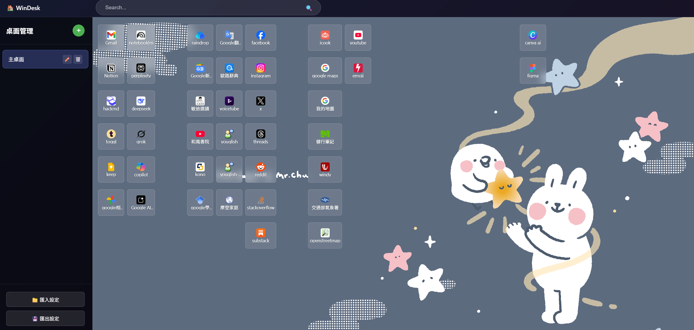
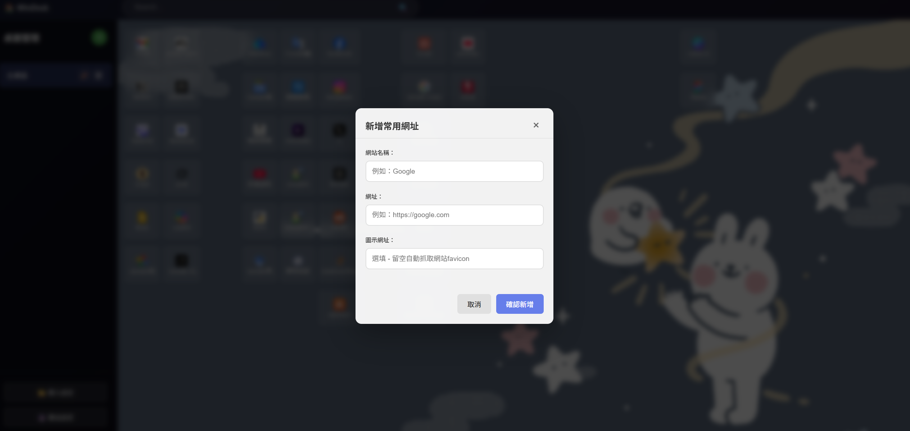
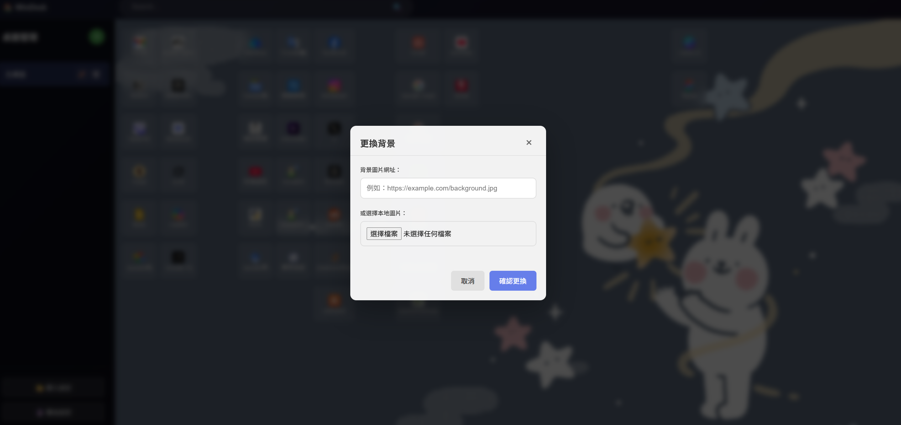

# WinDesk - Windows桌面風格新分頁


一個功能豐富的Chrome擴充軟體，讓你的瀏覽器新分頁變成類似Windows桌面的界面，可以自由管理和排列常用網站。






## ✨ 主要功能

### 🖥️ 桌面管理
- **多桌面支援**：創建多個虛擬桌面，每個都可以獨立管理
- **桌面重命名**：為每個桌面設置個性化名稱
- **快速切換**：在左側邊欄輕鬆切換不同桌面

### 🔗 網站圖示管理
- **20×9網格布局**：支援多達180個網站圖示
- **拖拽排列**：自由拖曳圖示到任意位置
- **智能favicon**：自動抓取網站圖示，無需手動設置
- **右鍵新增**：右鍵點擊桌面空白處快速新增網站

### 🎨 個性化設置
- **自訂背景**：支援網路圖片或本地檔案作為桌面背景
- **響應式設計**：完美適配桌面和行動裝置
- **視覺效果**：現代化UI設計，支援毛玻璃特效

### 💾 數據管理
- **雲端同步**：使用Chrome同步存儲，多裝置無縫同步
- **匯入匯出**：支援JSON格式備份和恢復設定
- **數據持久化**：所有設定自動保存，重啟瀏覽器不丟失

### 🔍 搜索功能
- **智能搜索**：支援直接網址訪問和Google搜索
- **快速跳轉**：輸入網址直接跳轉到目標網站

## 🚀 安裝方式

### 方法一：開發者模式安裝
1. 下載或Clone本專案到本地
2. 開啟Chrome瀏覽器，進入 `chrome://extensions/`
3. 啟用右上角的「開發人員模式」
4. 點擊「載入未封裝項目」
5. 選擇專案資料夾
6. 安裝完成！開啟新分頁即可使用

### 方法二：打包安裝
1. 在擴充功能頁面點擊「封裝擴充功能」
2. 選擇專案資料夾生成.crx檔案
3. 拖拽.crx檔案到Chrome進行安裝

## 📖 使用說明

### 新增網站
1. 右鍵點擊桌面空白區域
2. 選擇「新增常用網址」
3. 填入網站名稱和網址（圖示網址可選填）
4. 點擊確認，圖示將自動放置到桌面

### 管理桌面
1. 點擊左側邊欄的「+」按鈕新增桌面
2. 點擊桌面名稱切換到該桌面
3. 點擊編輯按鈕重命名桌面
4. 點擊刪除按鈕移除桌面（至少保留一個）

### 排列圖示
1. 直接拖拽任意圖示到目標位置
2. 如果目標位置已有圖示，兩者會自動交換位置
3. 所有變更會自動保存

### 更換背景
1. 右鍵點擊桌面空白區域
2. 選擇「更換背景」
3. 輸入圖片網址或選擇本地檔案
4. 點擊確認應用新背景

### 備份還原
1. 點擊左下角「匯出設定」備份當前配置
2. 點擊「匯入設定」選擇備份檔案進行還原

## 🛠️ 技術架構

### 前端技術
- **HTML5 + CSS3**：現代化響應式界面
- **Vanilla JavaScript**：輕量級，無第三方依賴
- **CSS Grid**：精確的網格佈局系統
- **Drag & Drop API**：原生拖拽功能

### Chrome API
- **chrome.storage.sync**：跨裝置數據同步
- **chrome.tabs**：新分頁管理
- **Manifest V3**：最新擴充功能標準

## 📁 專案結構

```
WinDesk/
├── manifest.json          # 擴充功能配置檔
├── newtab.html           # 主頁面HTML
├── styles.css            # 樣式表
├── script.js             # 主要功能邏輯
├── popup.html            # 擴充功能彈窗
├── icons/                # 擴充功能圖標
│   ├── icon16.png
│   ├── icon48.png
│   └── icon128.png
└── README.md            # 說明文件
```

## 🎯 功能亮點

- ✅ **20×9高密度網格**：比傳統桌面放置更多圖示
- ✅ **智能favicon抓取**：多重備援機制確保圖示顯示
- ✅ **平滑拖拽體驗**：原生HTML5拖拽API
- ✅ **多桌面管理**：無限制創建虛擬桌面
- ✅ **雲端同步**：Chrome帳號自動同步設定
- ✅ **完全離線**：無需網路連接即可使用
- ✅ **隱私保護**：所有數據存儲在本地

## 🔧 自訂開發

### 修改網格布局
編輯 `styles.css` 中的 `.desktop-content` 樣式：
```css
.desktop-content {
    grid-template-columns: repeat(20, 1fr);  /* 調整列數 */
    grid-template-rows: repeat(9, 1fr);      /* 調整行數 */
}
```

### 修改默認背景
編輯 `styles.css` 中的 `.desktop-area` 背景圖片URL

### 添加新功能
主要功能邏輯在 `script.js` 的 `WinDesk` 類別中

## 📊 版本歷程

### v1.0.0 (2025-08-15)
- ✨ 初始版本發布
- ✨ 支援20×9網格布局
- ✨ 多桌面管理功能
- ✨ 拖拽排列圖示
- ✨ 智能favicon抓取
- ✨ 自訂背景功能
- ✨ 匯入匯出設定

## 🤝 貢獻指南

歡迎提交Issue和Pull Request來改進WinDesk！

1. Fork本專案
2. 創建功能分支 (`git checkout -b feature/AmazingFeature`)
3. 提交變更 (`git commit -m 'Add some AmazingFeature'`)
4. 推送到分支 (`git push origin feature/AmazingFeature`)
5. 開啟Pull Request

## 📄 授權條款

本專案採用 MIT 授權條款 - 查看 [LICENSE](LICENSE) 檔案了解詳情

## 💡 常見問題

**Q: 圖示無法顯示怎麼辦？**
A: WinDesk會自動嘗試多個favicon來源，如果仍無法顯示，請檢查網址是否正確或手動提供圖示URL。

**Q: 設定會在不同電腦間同步嗎？**
A: 是的，只要使用相同的Google帳號登入Chrome，設定會自動同步。

**Q: 可以設定多少個圖示？**
A: 每個桌面支援180個圖示（20×9），可以創建無限個桌面。

**Q: 如何回到原本的新分頁？**
A: 停用或移除擴充功能即可恢復Chrome預設新分頁。

---

**讓WinDesk成為你的個人化瀏覽器桌面！** 🚀
